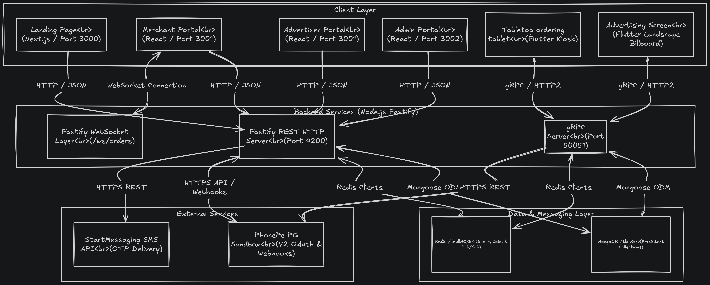
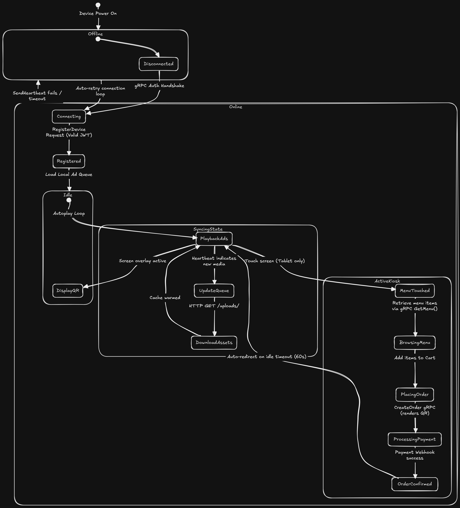
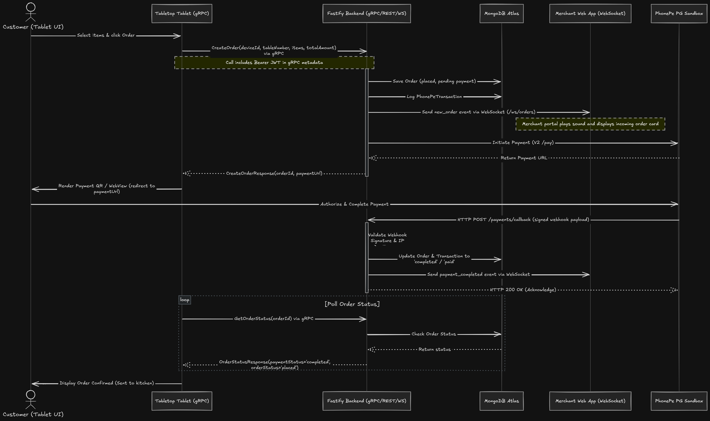

# DigiAds Platform

<p align="center">
  
</p>

<p align="center">
  <strong>Smart Tabletop Dining, Interactive Ordering & Venue Advertising Network</strong>
</p>

<p align="center">
  DigiAds is an integrated ecosystem uniting restaurant tabletop ordering, venue display advertising, and venue management across commercial Android tablets, wall screens, and web portals.
</p>

---

## 🛠️ Technology Stack

### Backend & Realtime Infrastructure
<p align="left">
  
  
  
  
  
  
  
  
  
  
  
</p>

### Frontend & Web Portals
<p align="left">
  
  
  
  
  
</p>

### Android Tablet & Screen Applications
<p align="left">
  
  
  
  
  
</p>

---

## 📊 Flow Diagrams & Architecture

### System Architecture


### Device Flow


### User Flow


---

## 🚀 Key Modules & Capabilities

### 🍽️ 1. Tabletop Smart Kiosk (`/tablet-app`)
*Built with Flutter, Kotlin & AndroidX Media3 ExoPlayer*
- **Interactive Digital Menu**: Visual food catalog with instant category filtering, item customization, and cart management.
- **Dual Ad Rotation**: Plays targeted sponsor campaigns and restaurant promotional videos with zero screen tearing.
- **Fail-Safe Video Engine**: 32-second hardware watchdog timer and offline caching guarantee uninterrupted playback even during network drops.
- **Enterprise Kiosk Lockdown**: Device Owner integration with automatic Wi-Fi activation on boot and single-app pin mode.
- **Silent OTA Updates**: Background update installer with SHA-256 verification and immediate post-install cleanup.

### 📺 2. Wall Screen Engine (`/screen-app`)
*Built with Flutter, Kotlin & AndroidX Media3 ExoPlayer*
- **Full HD Commercial Advertising**: High-definition video and static banner rotation designed for large venue wall displays.
- **Precision Scheduling**: Real-time frequency control (hourly cooldowns, continuous loops, and venue-targeted slots).
- **Live WebSocket & gRPC Sync**: Instant ad schedule reload and telemetry reporting.

### 🌐 3. User & Merchant Portal (`/user-portal`)
*Built with Next.js 15, React 19 & Tailwind CSS*
- **For Restaurant Hosts**:
  - Live order management dashboard with real-time audio alerts and WebSocket updates.
  - Digital menu builder with categories, pricing, item availability, and photo uploads.
  - Bill configuration & instant thermal/print invoice generation.
  - Venue promo media manager with automatic resolution verification.
- **For Advertisers**:
  - Targeted multi-step campaign builder (Filter by State → City → Specific Outlets).
  - Flexible spot packages (Per Device vs Whole Venue, Tablet vs Wall Screen).
  - Secure payment integration with PhonePe gateway.
  - Live campaign analytics, impression logs, and playback metrics.

### 🛡️ 4. Administrator Console (`/admin-portal`)
*Built with Next.js 15, React 19 & Tailwind CSS*
- **Centralized Moderation**: Built-in video preview player for approving or rejecting paid campaigns.
- **Device & Venue Fleet Management**: Provision, monitor, and manage tablet (`TAB_`) and wall screen (`SCR_`) hardware.
- **Spot Rates & Pricing Management**: Dynamic price configuration for tabletop and screen ad slots.
- **OTA Release Manager**: Publish and distribute APK updates over the air with mandatory/optional flags.
- **Financial & Analytics Reports**: Daily revenue projections, payout distributions, and platform audit logs.

### ⚡ 5. Core Backend Engine (`/server`)
*Built with Fastify, gRPC, Redis & BullMQ*
- **High-Performance REST & WebSockets**: Low-latency endpoints for orders, device telemetry, and live sync.
- **gRPC Services (Port 50051)**: High-speed Protobuf streaming for device heartbeats and ad impressions.
- **Intelligent Video Queue**: BullMQ-backed single-concurrency FFmpeg pipeline with resolution max-bounding (downscales 4K/2K to 1080p, preserves native aspect ratio, and applies macroblock alignment).
- **Multi-Role Security**: JWT authentication with SMS OTP verification via StartMessaging gateway.

---

## 🗂️ Project Structure

```text
digiads/
├── Flow_Diagrams/             # System architecture, device & user flow diagrams
├── Logo/                      # Brand assets & SVG logos
│
├── server/                    # Fastify REST, WebSockets, gRPC & BullMQ Backend
│   ├── config/                # Environment configurations (.env.dev, .env.prod)
│   ├── controllers/           # Business logic & API request handlers
│   ├── models/                # MongoDB Mongoose schemas
│   ├── protos/                # gRPC Protocol Buffer definitions
│   ├── routes/                # Fastify API route declarations
│   ├── services/              # SMS, Payment Gateway, and Video Transcoding queues
│   └── server.js              # Main backend bootstrap entry point
│
├── landing-page/              # Public marketing website (Port 3000)
├── user-portal/               # Merchant & Advertiser portal (Port 3002)
├── admin-portal/              # Platform Admin management dashboard (Port 3001)
│
├── tablet-app/                # Flutter Android Tabletop Ordering Kiosk
└── screen-app/                # Flutter Android Wall Display Advertising Engine
```

---

## 🔌 Port Mapping Configuration

| Service | Protocol | Default Port | Description |
| :--- | :--- | :--- | :--- |
| **Landing Page** | HTTP | `3000` | Public marketing website |
| **Admin Portal** | HTTP | `3001` | Platform administrator console |
| **User Portal** | HTTP | `3002` | Merchant & Advertiser portal |
| **Backend API & WS** | HTTP / WS | `4200` | REST endpoints & live WebSocket |
| **Backend gRPC** | HTTP/2 | `50051` | Tablet & Screen telemetry streams |
| **Redis** | TCP | `6379` | Background BullMQ transcode queue |

---

## 🚀 Quick Start Guide

### Prerequisites
- **Node.js**: v18 or v20 LTS+
- **Redis**: Local or system service (`redis-server`)
- **MongoDB**: MongoDB Atlas URI or local database
- **Flutter SDK**: v3.0+ (Only required for building Android APKs)

---

### Running in Development Mode

1. **Start the Backend Server**:
   ```bash
   cd server
   npm install
   npm run dev
   ```

2. **Start the Web Portals** (in separate terminals):
   ```bash
   # Landing Page (Port 3000)
   cd landing-page && npm install && npm run dev

   # Admin Console (Port 3001)
   cd admin-portal && npm install && npm run dev

   # User & Merchant Portal (Port 3002)
   cd user-portal && npm install && npm run dev
   ```

3. **Build the Tablet App (APK)**:
   ```bash
   cd tablet-app
   flutter build apk --release --android-skip-build-dependency-validation
   ```

---

### Production Deployment (Linux VPS with PM2)

```bash
# 1. Start Backend Server
cd server
npm install --omit=dev
pm2 start server.js --name "digiads-server" -- --env-file=config/.env.prod

# 2. Build and Start Web Portals
cd ../admin-portal
npm install && npm run build
pm2 start npm --name "digiads-admin" -- start -- -p 3001

cd ../user-portal
npm install && npm run build
pm2 start npm --name "digiads-user" -- start -- -p 3002

cd ../landing-page
npm install && npm run build
pm2 start npm --name "digiads-landing" -- start -- -p 3000

# 3. Persist Process List across Reboots
pm2 save
pm2 startup
```

---

## 📄 License
Commercial proprietary software. Developed for **DigiAds** / **Aibot Ink**. All rights reserved.
